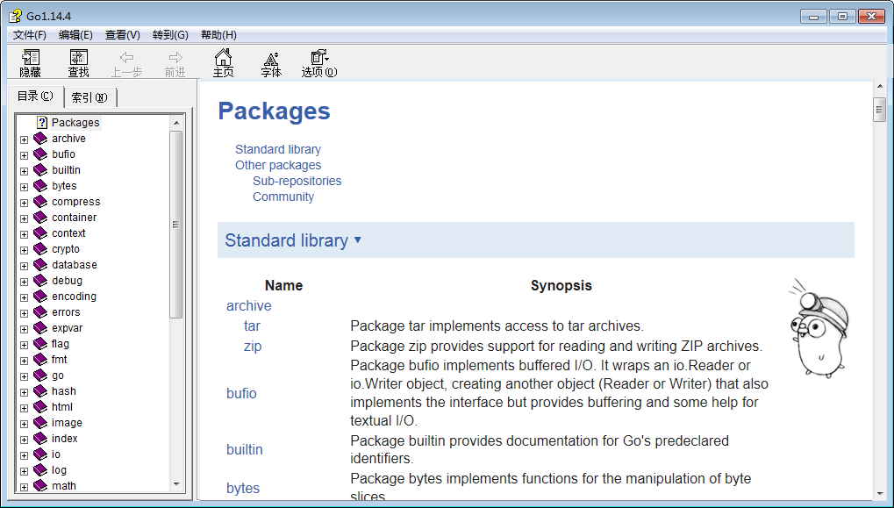
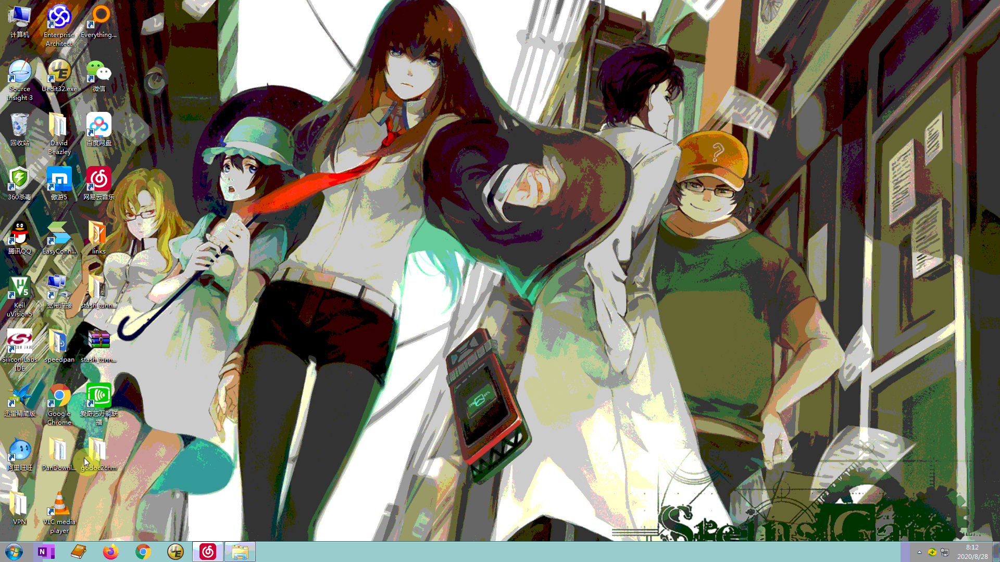

# Gochm
Try to keep up with the latest version. It is expected to help you master the Go standard library more easily.  
If you have any suggestions or requirements, please feel free to contact me by email.

# What problems it solve
+ The navigation panel show the standard library packages' hierarchy more clearly.   
+ 🌟 The navigation panel `improve the efficiency` of switching between packages, switching between objects in a package.    
+ The search panel can quickly locate relevant content by keywords.  

  🚀 **`If this project helps you, please feel free to star it, the attention is my motivation for updating.`**
# Demo
https://www.bilibili.com/video/av244396662

# Usage
To avoid errors like this:

Changing the registry settings according to your Internet Explorer version.

|  IE Version    | Setting       |
| -------------  | ------------- |
| IE11 | [HKEY_LOCAL_MACHINE\SOFTWARE\Microsoft\Internet Explorer\MAIN\FeatureControl\FEATURE_BROWSER_EMULATION]"hh.exe"=dword:00002AF8  |
| IE10 | [HKEY_LOCAL_MACHINE\SOFTWARE\Microsoft\Internet Explorer\MAIN\FeatureControl\FEATURE_BROWSER_EMULATION]"hh.exe"=dword:00002710  |
| IE9  | [HKEY_LOCAL_MACHINE\SOFTWARE\Microsoft\Internet Explorer\MAIN\FeatureControl\FEATURE_BROWSER_EMULATION]"hh.exe"=dword:00002328  |
| IE8  | [HKEY_LOCAL_MACHINE\SOFTWARE\Microsoft\Internet Explorer\MAIN\FeatureControl\FEATURE_BROWSER_EMULATION]"hh.exe"=dword:00001F40  |
| IE7  | [HKEY_LOCAL_MACHINE\SOFTWARE\Microsoft\Internet Explorer\MAIN\FeatureControl\FEATURE_BROWSER_EMULATION]"hh.exe"=dword:00001B58  |

# Version
2020-04-13 gochm 1.14.2  
2020-06-17 gochm 1.14.4  
+ add examples to content items  
+ optimize content item icon
