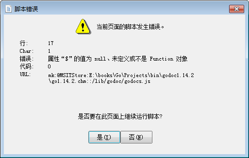

# gochm
Try to keep up with the latest version. It is expected to help you master the Go standard library more easily.

If you have any suggestions or requirements, please feel free to contact me by email.

# Usage
To avoid errors like this:

According to the version of Internet Explorer used by your system, change the corresponding settings in the registry.

| IE Version  | Setting |
| ------------- | ------------- |
| IE11 | [HKEY_LOCAL_MACHINE\SOFTWARE\Microsoft\Internet Explorer\MAIN\FeatureControl\FEATURE_BROWSER_EMULATION]"hh.exe"=dword:00002AF8  |
| IE10 | [HKEY_LOCAL_MACHINE\SOFTWARE\Microsoft\Internet Explorer\MAIN\FeatureControl\FEATURE_BROWSER_EMULATION]"hh.exe"=dword:00002710  |
| IE9  | [HKEY_LOCAL_MACHINE\SOFTWARE\Microsoft\Internet Explorer\MAIN\FeatureControl\FEATURE_BROWSER_EMULATION]"hh.exe"=dword:00002328  |
| IE8  | [HKEY_LOCAL_MACHINE\SOFTWARE\Microsoft\Internet Explorer\MAIN\FeatureControl\FEATURE_BROWSER_EMULATION]"hh.exe"=dword:00001F40  |
| IE7  | [HKEY_LOCAL_MACHINE\SOFTWARE\Microsoft\Internet Explorer\MAIN\FeatureControl\FEATURE_BROWSER_EMULATION]"hh.exe"=dword:00001B5   |
